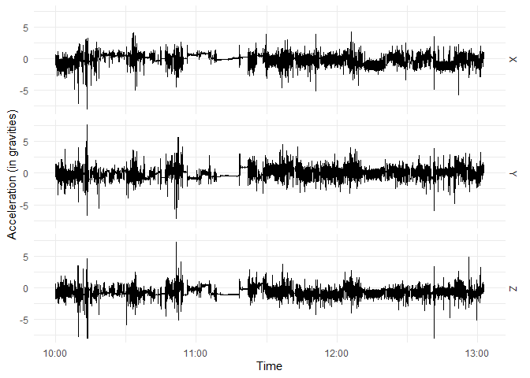
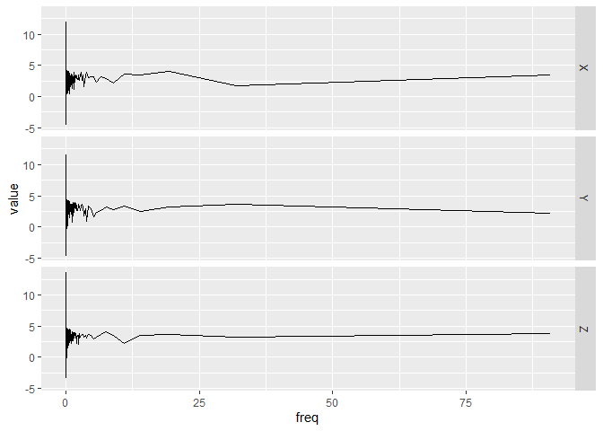

<!-- README.md is generated from README.Rmd. Please edit that file -->

# bis620.2022

<!-- badges: start -->

[](https://github.com/Lizwwwwwww/bis620.2022/actions/workflows/R-CMD-check.yaml)
[](https://github.com/Lizwwwwwww/bis620.2022/actions/workflows/lint.yaml)
[](https://github.com/Lizwwwwwww/bis620.2022/actions/workflows/test-coverage.yaml)
<!-- badges: end -->

The goal of bis620.2022 is to generate time series plot and spectral
signature plot from the UKBiobank accelerometry data.

## Installation

You can install the development version of bis620.2022 from
[GitHub](https://github.com/) with:

``` r
# install.packages("devtools")
devtools::install_github("Lizwwwwwww/bis620.2022")
```

## Example

This is a basic example which shows you how to use the `accel_plot()`
function to draw a time series plot of `X`, `Y` and `Z` in the UKBiobank
accelerometry data:

``` r
library(bis620.2022)
library(lubridate)
#> 
#> 载入程辑包：'lubridate'
#> The following objects are masked from 'package:base':
#> 
#>     date, intersect, setdiff, union
library(ggplot2)
#> Warning: 程辑包'ggplot2'是用R版本4.2.2 来建造的

data(ukb_accel)

dt <- dplyr::first(ukb_accel$time)

ukb_accel |>
 # filter(time >= dt  & time < dt + minutes(5)) |>
  accel_plot() +
    theme_minimal() +
    xlab("Time") +
    ylab("Acceleration (in gravities)")
```

 This is a
basic example which shows you how to use the `spectral_signature()`
function to get the spectral signature of accelerometry data:

The value of `take_log` decides whether the spectral signature is
calculated by taking the modulus of the Fourier coefficients of the
signal, its default value is `TRUE`.

The value of `inverse` decides whether should the unnormalized inverse
transform is computed, its default value is `TRUE`.

``` r
library(bis620.2022)
library(lubridate)
library(ggplot2)

data(ukb_accel)

dt <- dplyr::first(ukb_accel$time)

ukb_accel |>
#  filter(time >= dt & time < dt + minutes(5)) |>
  spectral_signature(take_log = TRUE, inverse = TRUE) |>
  accel_plot()
```

 The value
of `take_log` decides whether the spectral signature is calculated by
taking the modulus of the Fourier coefficients of the signal, its
default value is `TRUE`.
